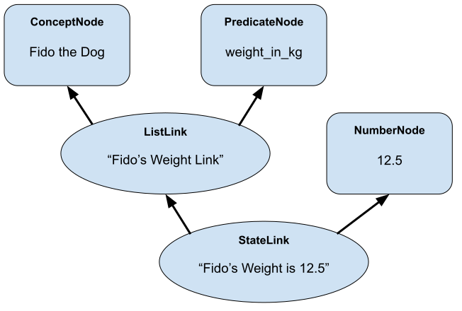

.. role:: scheme(code)
   :language: scheme

.. _02_representing_knowledge:

Previous Chapter: :ref:`Getting Oriented <01_getting_oriented>`

========================================================================
Structured Knowledge & Simple Queries
========================================================================

In the last chapter, we learned how we can think of the Atomspace as a database of documents.  Each Atom is like a document that can contain a set of key-value pairs.
But document-store database solutions are already plentiful and the value of the Atomspace comes from other capabilities.

So now we'll begin to explore the Atomspace as a knowledge representation format, or *Knowledge Base*; Often abbreviated as *KB*.

KBs hold a collection of concepts and define them in relationship to other concepts.  KBs are a relatively old idea, not unique to the Atomspace, and there is a Wikipedia page covering the basics: `<https://en.wikipedia.org/wiki/Knowledge_base>`_

This guide and nearly every other piece of documentation on KBs I've encountered describe the primitives of knowledge representation using concrete examples from the real world, such as "A dog is an animal."  This is helpful for learning the particulars of the KB because the fundamental conceptual relationships are already familiar to most people.
However, I believe a large amount of the value of KBs and ontologies come from the ability to reason within an abstract systems of precise relationships where that precision has been imposed elsewhere, at another level, or where ambiguity never existed to begin with.  For example, a KB could be used to reason about the behavior of a computer program, given a hypothetical set of inputs.

In general, strictly regular KBs have many limitations when representing data from real world.  For example, the `InheritanceLink <https://wiki.opencog.org/w/InheritanceLink>`_ documentation points out the difference between Extensional vs. Intentional Inheritance.  I'd argue this is just the tip of the iceberg when trying to formalize knowledge about the fuzzy real world into a crisp ontology.
That being said, the Atomspace is better than most other KB formats, because of the tools it provides for expressing nuance, partial truth and uncertainty.  All the same, in my opinion, a symbolic KB alone is not sufficient for many aspects of real-world knowledge representation.  Regardless, I'll attempt to refrain from injecting too much of my own personal opinions and conclusions into this guide dedicated to understanding the Atomspace.

Ultimately, any formal language is only as precise as the axioms and definitions it is built upon, and you will have to define your own grammar.  Personally I view the Atomspace less as a language and instead as the building-blocks out of which a language can be created.
Some people have used the Atomspace to represent tokens and grammar from a natural language such as English, while others have used it to represent interactions between proteins and genes.  In its purest form, the Atomspace is a system where data and rules about how the data can interact can be described side-by-side, and then queried and simulated.

PredicateNode & Links to make statements
------------------------------------------------------------------------

We touched on :code:`PredicateNode` in the last chapter when we used them as keys for values we associated with other atoms.
In grammar, a statement is divided into subject(s) and a predicate.  "The dog barks."  'Barks" is the predicate.
In the statement: "The dog is happy", "is happy" is the predicate.

The important thing about predicates is that they allow assertions to be made.  Concepts by themselves don't say anything, they merely exist (or don't exist), but predicates allow for statements.

In the Atomspace, a :code:`PredicateNode` provides a label for these predicate concepts.
A more formal description of a :code:`PredicateNode` in the Atomspace is here: `<https://wiki.opencog.org/w/PredicateNode>`_  Formally, a :code:`PredicateNode` is a node that can be evaluated to create a *TruthValue*.  In the next chapter we'll cover exactly how predicates are evaluated, but for now it's ok if this idea is a little vague.

As seen in previous chapter, the below Scheme snippet tells the Atomspace that "Fido the Dog's weight is 12.5kg".

.. code-block:: scheme

   (cog-set-value! (Concept "Fido the Dog")
      (Predicate "weight_in_kg") (FloatValue 12.5))

Now, I can retrieve the :code:`weight_in_kg` using the :code:`cog-value` command, as demonstrated previously, but say I want to search for all dogs in the Atomspace whose weight is under 15kg.
Values associated with atoms are not indexed, so a query like that would be inefficient.  

If I have the atom, I can get a value attached to it in constant time, but if I am looking for atoms with an associated value that meets some criteria, this is generally a bad idea as the time required for the search grows with the number of atoms being examined.

Here is another way to express the statement "Fido the Dog's weight in kg is 12.5".

.. code-block:: scheme

   (StateLink
      (ListLink
         (Concept "Fido the Dog")
         (Predicate "weight_in_kg")
      )
      (NumberNode 12.5)
   )

Let's break down exactly what we just did.  We created two new link atoms and a new :code:`NumberNode` node atom.

Here is a graphical representation of the atom relationships we just expressed.

In the inner-part of the expression, we created a :code:`ListLink` atom that references :code:`(Concept "Fido the Dog")` and :code:`(Predicate "weight_in_kg")`.
This :code:`ListLink` is just a simple association between the other two node atoms.

The formal description of :code:`ListLink` tells us we should think of this as an argument list, and from a programming language perspective this makes sense.
Personally, however, I prefer to think about it from a natural language perspective.
By definition, this particular :code:`ListLink` atom is *the* :code:`ListLink` atom that references :code:`(Concept "Fido the Dog")` and :code:`(Predicate "weight_in_kg")` in that order.
Therefore, in this context, you can think of it as the atom that means "Fido the Dog's weight in kg".
Basically, a single atom, i.e. our new link atom, is able to represent a compound concept created by combining two other atoms.

The documentation for :code:`ListLink` is here: `<https://wiki.opencog.org/w/ListLink>`_, if you want to understand it more precisely.  

Moving on, the outer part of the expression creates a :code:`StateLink`.  The :code:`StateLink` atom that we just made references our newly-created :code:`ListLink` and a newly-created :code:`NumberNode` that has the "label" of "12.5".
A :code:`StateLink` is like a :code:`ListLink` insofar as it also references other atoms and provides a way to reference this newly combined concept as an atom itself.

The main feature of a :code:`StateLink` is that there can be only one :code:`StateLink` for each referant in position 0 (Zero) of the :code:`StateLink`'s outbound set.
So, referring back to our example, "Fido the Dog's weight in kg" can only have one :code:`StateLink` that points to it as the link's first referenced atom.
In plain English, "Fido the Dog's weight in kg" can only be one thing at a time.  His weight can't simultaneously be 12.5kg and 15kg.  Setting it to 15kg will update the :code:`StateLink` atom that's already there, rather than creating a new atom.

The documentation for :code:`StateLink` is here: `<https://wiki.opencog.org/w/StateLink>`_.

In addition, more documentation and examples along these lines can be found in these OpenCog examples: `<https://github.com/opencog/atomspace/blob/master/examples/atomspace/state.scm>`_ & `<https://github.com/opencog/atomspace/blob/master/examples/atomspace/property.scm>`_

A Basic Query with MeetLink & VariableNode
------------------------------------------------------------------------

Now that we've told the Atomspace that "Fido the Dog's weight in kg is 12.5", how can we retrieve that information?  How do we ask "What is Fido the Dog's weight in kg?"

Like this:

.. code-block:: scheme

   (cog-execute!
      (MeetLink
         (StateLink
            (ListLink
               (Concept "Fido the Dog")
               (Predicate "weight_in_kg")
            )
            (VariableNode "$v1")
         )
      )
   )

We'll go through what we just did, step by step.  But first, I want to rewrite the above statement so our code can be a little less verbose and we can focus on what really matters.

.. code-block:: scheme

   (define fidos_weight_link (List
      (Concept "Fido the Dog")
      (Predicate "weight_in_kg")))

Since Fido's weight is something we're referencing often, we can use Scheme's :scheme:`define` feature to create a single token to refer to it.

Now our query looks like this:

.. code-block:: scheme

   (cog-execute!
      (Meet
         (State
            fidos_weight_link
            (Variable "$v1")
         )
      )
   )

Just like we abbreviated :code:`ConceptNode` and :code:`PredicateNode` earlier, we can abbreviate :code:`ListLink` as just :code:`List` and :code:`StateLink` as :code:`State`.
Now that I've introduced them, I'll also start abbreviating :code:`MeetLink` as :code:`Meet`, :code:`VariableNode` as :code:`Variable`, etc.  You get the idea, so I won't explicitly explain abbreviations from here onward.

Anyway, let's get to the meat of what we just did.  First, notice the :code:`cog-execute!` function call.
This is invoking an OpenCog function which tells the Atomspace to execute a link.  What does it mean to execute a link?  

So far, the links we've seen, like the :code:`ListLink` and :code:`StateLink` we used above, have just been declarative.
But some types of links are *Active*, in other words they are "executable", meaning they can perform some operation, which varies from one link type to another.
Often executing a like synthesizes a new Value, but also it can create new atoms in the Atomspace or even delete existing atoms.
Some Link types may be Active as well as declarative, and which operation occurs depends on the context in which the link is accessed.

:code:`MeetLink` is one of the Active, aka executable, link types.  Executing a :code:`MeetLink` performs a query in the Atomspace, and returns the atoms found by the query.

Let's look at the atom that our :code:`MeetLink` is referencing.  This atom is our query:

.. code-block:: scheme

   (State
      fidos_weight_link
      (Variable "$v1")
   )

This can be thought of as a "Match Expression", because executing the :code:`MeetLink` will search the Atomspace for all atoms that match this atom we provided.
The :code:`VariableNode` can then be thought of as the wildcard.  The wildcard can match any other atom.
If you are familiar with `Regular Expressions <https://www.regular-expressions.info/quickstart.html>`_, this is the same principle.

So, you might interpret this query expression as saying "Find all the :code:`StateLink` atoms that connect :code:`fidos_weight` to *something*.
What are all the *somethings* that you found?"

When we execute our query, it should return:

.. code-block:: scheme

   (QueueValue  (NumberNode "12.5"))

You probably spotted our :code:`(NumberNode "12.5")` atom.  It's here because it was matched by the :code:`VariableNode` in the query, but what's with the :code:`QueueValue`?

A :code:`QueueValue` is a list of atoms or other values.
:code:`cog-execute!` returns a :code:`QueueValue` instead of a "naked" node atom because a query may match more than one atom and there is no way to know the number of results that will be found, in the general case.

Lastly, let's get our query result back into Scheme.  The Scheme snippet below adds 50 to Fido's weight, just like the example from the previous chapter.

.. code-block:: scheme

   (+
      (cog-number
         (car
            (cog-value->list
               (cog-execute!
                  (Meet
                     (State
                        fidos_weight_link
                        (VariableNode "$v1")
      )  )  )  )  )  )
      50
   )

Because :code:`cog-execute!` returns a :code:`QueueValue` to us, we must get the first element of the :code:`QueueValue`, which will be a :code:`NumberNode`.  We can then extract the numerical value from that :code:`NumberNode`.

We use the :code:`cog-value->list` OpenCog function to convert the :code:`QueueValue` into a Scheme list, and then use Sheme's :scheme:`car` to extract the first element of that list.
Finally, we can use the :code:`cog-number` OpenCog function to convert the :code:`NumberNode` into a Scheme number, before performing the arithmetic in Scheme.

.. note:: QUESTION for someone smarter than me. Why does (cog-value-ref) give me "index out of range" errors on QueueValues??  It seems like this should be something that works, conceptually.  If not, what are the preferred semantics (most efficient) for dequeueing an element?

That's probably enough on this simple query.  If you want a more complete explanation, the documentation for :code:`VariableNode` is here: `<https://wiki.opencog.org/w/VariableNode>`_ and the documentation for :code:`MeetLink` is here: `<https://wiki.opencog.org/w/MeetLink>`_

More Elaborate Queries with other Link Types
------------------------------------------------------------------------

This is a good place to introduce the concepts of *Grounded* vs *Ungrounded* expressions.
The formal definition is that ungrounded expressions contain 1 or more *Free* :code:`VariableNode` atoms, while grounded expressions don't contain any.
Personally, the way I think about it is that grounded expressions are statements and ungrounded expressions are questions.

Just as in English, questions and statements can take a similar gramatical form.  Consider this example. 
Statement: "The man is running."  Question: "Who is running?" Answer: "The man".

The question-word "Who" in this example is like a :code:`VariableNode`.
When the question is matched against the statement, the relative gramatical position of the word "Who" indicates which part of the statement will appropriately answer the question.

So, another intuition for :code:`MeetLink` is that it takes an ungrounded expression and returns a grounded expression.
Or said another way, it takes a question and returns an answer.

So let's flip our previous question inside out.  Consider this query:

.. code-block:: scheme

   (cog-execute!
      (Meet
         (State
            (Variable "$v1")
            (Number 12.5)
         )
      )
   )

Our previous question was: "What is Fido the Dog's weight in kg?".  Now our question is: "What value is 12.5?".
Executing that snippet should return our :code:`ListLink` that represents Fido's weight.

You've probably noticed the :code:`VariableNode` atom's label, :code:`"$v1"`.  This is just an arbitrary label, no different than the other labels we've used such as "Fido the Dog".
The Atomspace allows you to use multiple :code:`VariableNode` atoms to compose compound questions.
For example the English question: "What cities in Germany are on the river Danube?" is a compound question because it has two parts, "In Germany" and "On the river Danube".

Soon we'll get to the uses for multiple :code:`Variable` nodes within a query.
Right now, let's give Fido a friend by executing this Scheme snippet:

.. code-block:: scheme

   (StateLink
      (ListLink
         (Concept "Fluffy the Dog")
         (Predicate "weight_in_kg")
      )
      (NumberNode 17)
   )

Now, I want to ask the Atomspace to find the dogs that have a weight over 15kg.  My query looks like this:

.. code-block:: scheme

   (cog-execute!
      (QueryLink
         (And
            (State
               (List
                  (Variable "dog_node")
                  (Predicate "weight_in_kg")
               )
               (Variable "dogs_weight_node")
            )
            (GreaterThan
               (Variable "dogs_weight_node")
               (Number 15)
            )
         )
         (Variable "dog_node")
      )
   )

We found Fluffy!

Now, let's go over the new Link types I just introduced, and I'll explain the query along the way.

QueryLink
^^^^^^^^^^^^^^^^^^^^^^^^^^^^^^^^^^^^^^^^^^^^^^^^^^^^^^^^^^^^^^^^^^^^^^^^

:code:`QueryLink` is another way to execute a query.  It is just like the :code:`MeetLink` atom, that we used in the previous examples, except that :code:`QueryLink` allows us to declare the format for the query results.

To understand this better, try this nearly identical version of the query using :code:`MeetLink` instead of :code:`QueryLink`.

.. code-block:: scheme

   (cog-execute!
      (Meet
         (And
            (State
               (List (Variable "dog_node") (Predicate "weight_in_kg"))
               (Variable "dogs_weight_node"))
            (GreaterThan (Variable "dogs_weight_node") (Number 15))
   )  )  )

As you can see, it also returns the "Fluffy the Dog".  But unlike the :code:`QueryLink` version, the result is a bit more cluttered.

The :code:`MeetLink` version returns:

.. code-block:: scheme

   (QueueValue  (ListLink
      (ConceptNode "Fluffy the Dog")
      (NumberNode "17")))

While the :code:`QueryLink` version returns:

.. code-block:: scheme

   (QueueValue  (ConceptNode "Fluffy the Dog"))

That is because we explicitly told the :code:`QueryLink` atom that we were interested in :code:`(Variable "dog_node")` as our result.  On the other hand, the :code:`MeetLink` atom created a :code:`ListLink` referencing all of the :code:`VariableNode` atoms in our query.

You can think of :code:`QueryLink` as performing two operations in sequence.  First, it performs a query to search for matching atoms, and then it performs a subsequent step to format the results as new atoms.

.. note:: Much of the documentation and examples are written to feature :code:`GetLink` instead of :code:`MeetLink`, and :code:`BindLink` instead of :code:`QueryLink`.  The only semantic difference between these is that :code:`MeetLink` and :code:`QueryLink` return results as a :code:`QueueValue` which is transient, while :code:`GetLink` and :code:`BindLink` return a :code:`SetLink` which will become part of the Atomspace until it is deleted.  To avoid cluttering up the Atomspace and the performance costs associated with that, the :code:`QueueValue` functions are better.

The "get-put.scm" OpenCog example demonstrates exactly how a :code:`BindLink` can be composed from a :code:`GetLink` and a :code:`PutLink`.  
The examples apply equally well to :code:`QueryLink` and :code:`MeetLink`.
I recommend going through that example as well as the "bindlink.scm" example, which can be found here: `<https://github.com/opencog/atomspace/blob/master/examples/atomspace/bindlink.scm>`_ & `<https://github.com/opencog/atomspace/blob/master/examples/atomspace/get-put.scm>`_

AndLink
^^^^^^^^^^^^^^^^^^^^^^^^^^^^^^^^^^^^^^^^^^^^^^^^^^^^^^^^^^^^^^^^^^^^^^^^

:code:`AndLink` is a link atom type for performing the binary "And" operation.  You probably guessed that from its name.
So, for a query to match, both sides of the :code:`AndLink` must be satisfied.

Back to our example:

.. code-block:: scheme

   (And
      (State
         (List
            (Variable "dog_node")
            (Predicate "weight_in_kg")
         )
         (Variable "dogs_weight_node")
      )
      (GreaterThan
         (Variable "dogs_weight_node")
         (Number 15)
      )
   )

This query's use of :code:`And` is essentially saying "Find an atom connected to the *weight_in_kg* atom with a :code:`ListLink` that itself is connected to another atom by a :code:`StateLink` **AND** the numerical value of that other atom is greater than 15."

Try experimenting a bit with this query.  For example, if you change the query to compare against :code:`(Number 10)` instead of :code:`(Number 15)`, you will find the query returns both Fido and Fluffy.

Moving on, notice that the :code:`(Variable "dogs_weight_node")` atom appears on both sides of the :code:`And` expression.  This is important.  

As somebody with a strong background in procedural programming, the way I think about this is that the :code:`Variable` node is "defined" or temporarily given a value by the first side of the :code:`And` expression, and then that value is used when evaluating the second side.
However, if your intuition comes from databases, you may want to think of the operation as an "INNER JOIN" from SQL.  These mental models are functionally equivalent.

If you're curious, the Atomspace has an :code:`OrLink` along with some other logical link types.  However, if your intention is to perform an "OUTER JOIN", you probably want to use :code:`ChoiceLink` instead of :code:`OrLink`.
"And" expressions narrow the *Satisfying Set* while "Or" expressions expand it.  Therefore you may need to be careful using :code:`Variable` nodes on both sides of an "Or" expression and expecting them to be consistent.  The behavior may not be what you intend.
There is certinly more that could be said here, but it feels like a rat hole at this point in the guide.

GreaterThanLink
^^^^^^^^^^^^^^^^^^^^^^^^^^^^^^^^^^^^^^^^^^^^^^^^^^^^^^^^^^^^^^^^^^^^^^^^

As the name suggests, :code:`GreaterThanLink` compares two :code:`NumberNode` atoms using the "**>**" operator.

In the section above covering :code:`AndLink`, we already explaind how the :code:`(Variable "dogs_weight_node")` atom gets its value from the other side of the :code:`AndLink` expression.
So this comparison evaluates to *true* if the numeric value of the atom matched by the Variable node is greater than :code:`(Number 15)`.  All pretty self-explanatory so far.

I'll take this opportunity to introduce other link types along the same lines:

   - `EqualLink <https://wiki.opencog.org/w/EqualLink>`_ Determines whether two atoms are actually the same atom, or whether they become the same atom when they are evaluated.  **Be careful** because :code:`NumberNode` atoms don't get converted to values for comparison by :code:`EqualLink`, in the same way they would be converted by :code:`GreaterThanLink`.  For example, using :code:`EqualLink` to compare :code:`(FloatValue 1.0)` with :code:`(NumberNode 1.0)` will evaluate to *false*!
   - `NotLink <https://wiki.opencog.org/w/NotLink>`_ Is the logical "Not" operator.  Evaluates to *true* if the atom it references evaluates to *false* and vice-versa.  Things get a little more complicated when considering non-binary TruthValues, but that's a topic we'll cover later.
   - `PlusLink <https://wiki.opencog.org/w/PlusLink>`_ Is the arithmetic operator for addition.  It references two :code:`NumberNode` atoms, and creates a third with the value of the sum of the other two.
   - `MinusLink <https://wiki.opencog.org/w/MinusLink>`_ Is the arithmetic operator for subtraction.  It references two :code:`NumberNode` atoms, and creates a third with the value of first minus the second.
   - `TimesLink <https://wiki.opencog.org/w/TimesLink>`_ Is the arithmetic operator for multiplication.  It references two :code:`NumberNode` atoms, and creates a third with the value of the product of the other two.
   - `DivideLink <https://wiki.opencog.org/w/DivideLink>`_ Is the arithmetic operator for division.  I'm sure you've spotted the pattern by now.

You may have noticed that "LessThanLink" is absent.  The less-than operator itself is just syntactic sugar because the argument order to :code:`GreaterThanLink` can implement a logically identical "LessThanLink".  Personally I've often wondered why more programming languages don't conserve the less-than operator this way.  Presumably the cost is tiny compared with improved code readability.

.. note:: QUESTION for someone smarter than me. How does one check for numerical equality?  In other words, a link or other operator that can sucessfully compare a NumberNode with a numerical value.  Also, I saw the note about the absence of (IntValue) etc., but comparing IEEE floats are problematic for many applications because values that are no longer representable with the mantissa bits become approximated.

I recommend exploring queries and Active Links further by going through the "assert-retract.scm" OpenCog example here: `<https://github.com/opencog/atomspace/blob/master/examples/atomspace/assert-retract.scm>`_
In particular, understanding the mechanics of :code:`PutLink` and :code:`DeleteLink` will help you understand what really happens when you invoke :code:`(cog-execute! SomeLink)` and drive home the execution model in the Atomspace.

ValueOfLink and Thinking About Performance
------------------------------------------------------------------------

Coming full circle, let's revisit values associated with atoms.  Let's associate an age with Fido, using the Scheme snippet below:

.. code-block:: scheme

   (cog-set-value! (Concept "Fido the Dog")
      (Predicate "age") (FloatValue 3))

It turns out you actually *can* query the Atomspace for atoms with some values that meet your query criteria.  You just need to be careful.
Consider the query below:

.. code-block:: scheme

   (cog-execute!
      (Meet
         (GreaterThan
            (ValueOf (Variable "dog_node") (Predicate "age"))
            (NumberNode 2)
         )
      )
   )

It returns Fido, just like you probably expected.  But not so fast!  Literally.

Executing this query involves iterating over every single atom in the Atomspace, and checking to see if it has the :scheme:`(Predicate "age")` key,
and if it does, then performing the comparison.  It may have appeared to be quick enough, but that's because you probably don't have many atoms in your atomspace.
Consider what would happen if your atomspace contained millions of atoms!

You can still use :code:`ValueOf` links in queries, but be careful that they are only applied to sets of a tractible size, and not all of the atoms in the Atomspace.

One strategy for accelerating this query is to create a link that tracks whether a given node contains a key.  Here is an example:

.. code-block:: scheme

   (cog-set-value! (Concept "Fido the Dog")
      (Predicate "age") (FloatValue 3))
   (Member
      (Concept "Fido the Dog")
      (Predicate "age")
   )

The :code:`MemberLink` atom is a sentinel that says "Fido the Dog has an age."
Mathmatically, it is saying "Fido the Dog is a member of the age set", where the "age" set is understood (by our convention) to contain all atoms that have an age value.

Now that we have a link we can query, we can compose a query using an :code:`AndLink`, like this:

.. code-block:: scheme

   (cog-execute!
      (Meet
         (And
            (Member
               (Variable "dog_node")
               (Predicate "age")
            )
            (GreaterThan
               (ValueOf (Variable "dog_node") (Predicate "age"))
               (NumberNode 2)
            )
         )
      )
   )

This query will also find Fido and all other dogs older than 2, just like our first version.  As you can see, the second branch of the query is identical to the one above.
However, this query will have considerably better performance characteristics as the number of atoms in the Atomspace grows.

Next Chapter: :ref:`TruthValues & Evaluation <03_truth_values_and_evaluation>`
